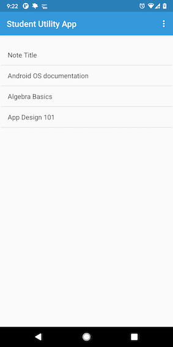
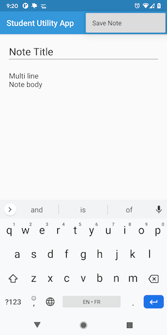
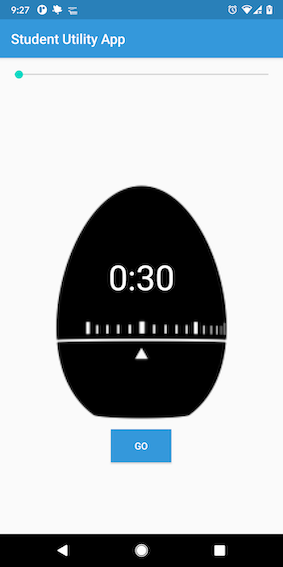
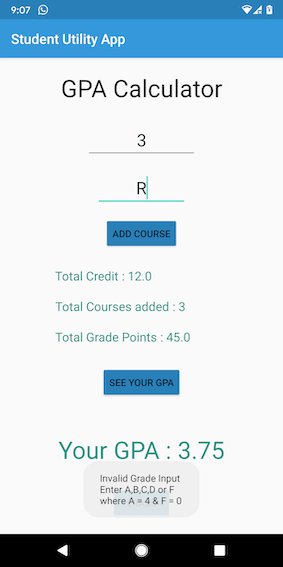

# Blog App API
 
## Overview
This is a simple student utility android app that has features of note taking, timer and a CPA calculator. It uses JAVA as the programming language and SQLite to store the notes locally in the device.

## Examples

## App Dashboard

### Note Taking

### Timer

### GPA Calculator

